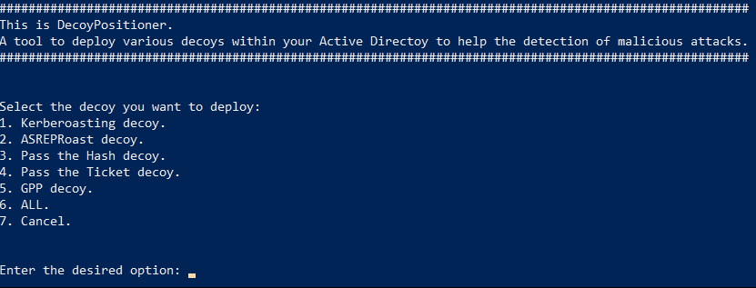

# DecoyPositioner
Tool to deploy various decoys within an Active Directoy to help the detection of malicious attacks:

- Kerbroasting: AD user with an SPN and several other parameters assigned.
- ASREPRoast: AD user without preauthentication required.
- Pass The Hash: Hash/credentials stored in memory
- Pass The Ticket: TGT is stored in memory
- GPP decoy: Directory tree that is equal to a legitimate GPP that has a password stored in one of its files.

# Detection
The actions carried on by an attacker who use or access one of these decoys will produce an Event that will be detectable by a monitoring software or EDR. This is so because no legitimate action executed by a normal user will lead to accessing these elements. 

# Considerations 
Names of the decoy users and services should be adapted to the naming pattern of the given company where they are meant to be deployed. These names can be found in the code of each decoy.

Naming of the files that execute the storage of the decoys in employee's machine files should be obfuscated to make them less noticeable to an eventual attacker.

# Testing environmet 
The tool was executed in a Domain Controller with the following characteristics:

- OS Name:                   Microsoft Windows Server 2019 Standard Evaluation
- OS Version:                10.0.17763 N/A Build 17763

The machine that was used to simulate a legitimate Employee's computer has these characteristics:

- OS Name:                   Microsoft Windows 10 Enterprise Evaluation
- OS Version:                10.0.19042 N/A Build 19042

# Documentation
[PDF document](https://drive.google.com/file/d/1DL2_Qqcr_UD0yUVbn2aJwAhstxGomHhB/view)
